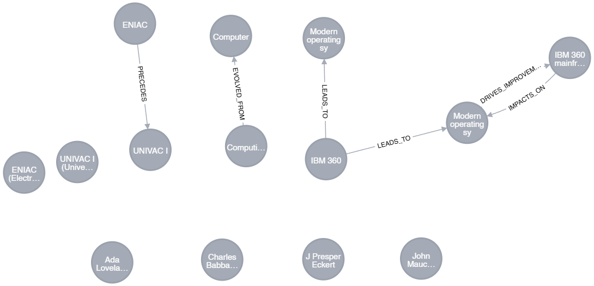

# Quantum Cognition

This project explores the intersection of quantum computing and cognitive science. It leverages Neo4j for graph database management and integrates with language models to extract and process entities and relationships.


## Local Setup
### Tools
 - Docker
 - Ollama

### Prerequisites
Before running the demo, you need to set up the required services using Docker Compose. Follow these steps:

- Install Docker and if you haven't already.
- Navigate to the project directory.

Run the following command to start the services:

```bash
docker-compose up -d
```
This will start the Neo4j and Ollama services defined in the docker-compose.yml file.

## Primary Demos

### Demo 1: Cognitive Assistant

The cognitive assistant demo is implemented in `main.py`. It allows users to interact with an assistant that uses a graph database to provide context-aware responses. The assistant performs the following steps:

1. **User Input**: The user provides input through the console.
2. **Context Retrieval**: The assistant retrieves relevant context from the Neo4j graph database.
3. **LLM Response Generation**: The assistant uses a language model to generate a response based on the user input and the retrieved context.
4. **Response Processing**: The assistant processes the response and updates the graph database if necessary.
5. **Output**: The assistant outputs the response to the user.

To run the demo, execute the following command:

```bash
python cognitive_app/main.py
```

Make sure to set up your environment variables in a .env file with the following keys:
Replace your_secure_password with your actual Neo4j password.

#### Example Conversation
```plaintext
**User**: What is computing? How did computers become so prevalent in our lives? How will they continue to evolve?

**Assistant**: Computing refers to the process of manipulating information using electronic devices, such as computers. The widespread use of computers in our daily lives can be attributed to their increasing power, miniaturization, and interconnectivity. As for the future evolution of computers, they are expected to become more intelligent, integrated into everyday objects, and continue to drive digital transformation across various sectors.

**User**: What is Artificial Intelligence?

**Assistant**: Artificial Intelligence (AI) is a branch of computer science that aims to create intelligent machines that work and learn 
like humans. It's a rapidly growing field responsible for advanced technology such as voice recognition, decision-making systems, and self-driving cars.

**User**: How does society use computing everyday, even in ways the layperson may not realize?
**Assistant**: Society uses computing in various ways daily, such as using computers or smartphones for tasks like browsing the web, sending emails, using apps, or even controlling home appliances. Some less obvious examples include using quantum computing for data encryption and analysis in financial transactions, or in scientific research.
```


[Detailed Graph Analysis](reports/graph_metrics_report_2024-11-10_21-31-50.txt)

### Demo 2: Automated Cognitive Assistant Test

The automated cognitive assistant test is implemented in `auto-test.py`. It allows users to run an automated test that uses a graph database to provide context-aware responses and build out the database by prompting itself with more questions.

```bash
python auto-test.py
```

#### Example Conversation
```plaintext
**User Prompt**: What is computing? How did computers become so prevalent in human's lives?

**Assistant**: Computing refers to the manipulation, processing, storage, and communication of data. The widespread use of computers in human life can be attributed to their evolution from large, room-sized machines to smaller, more portable devices over several decades. This progression has been driven by advancements in technology, miniaturization, and increasing demand for faster and more efficient information processing.

**Assistant Self-Prompt**: Can we delve deeper into the evolution of technology, specifically Computing and Computer, focusing on key milestones and significant advancements that shaped the field, their impacts, and how they laid the foundation for subsequent developments in both domains?

**Assistant**: I'm happy to help you explore the evolution of technology, particularly in Computing and Computer! Let's delve into some key milestones and significant advancements that shaped these domains. Here are a few examples: \n1. Charles Babbage and Ada Lovelace's Analytical Engine, which is considered one of the first programmable machines. This laid the foundation for modern computers.\n2. The invention of 
the ENIAC (Electronic Numerical Integrator And Computer) by John Mauchly and J Presper Eckert in 1946. It was the first general-purpose, electronic digital computer.\n3. The introduction of the UNIVAC I (Universal Automatic Computer I) by Remington Rand in 1951. It was the first commercially successful computer and could perform calculations much faster than its predecessors.\n4. The creation of the IBM 360 mainframe computer series in the mid-1960s, which popularized the concept of compatible computers and became the backbone for many businesses and institutions.

**Assistant Self-Prompt**: Can you help me understand the evolution of computing technology from ENIAC to UNIVAC I, focusing on the key innovations and improvements in hardware and software during this time period?

**Assistant**: The evolution of computing technology began with ENIAC (Electronic Numerical Integrator And Computer), which was followed by the UNIVAC I (Universal Automatic Computer I). The key innovations and improvements in hardware during this time period include transitioning from vacuum tubes to transistors. In terms of software, early mainframe computers like the IBM 360 series laid the foundation for modern operating systems and applications. ENIAC predates these advancements, but it introduced the concept of stored program computing.
```



[Detailed Graph Analysis](reports/graph_metrics_report_2024-11-10_21-51-53.txt)
